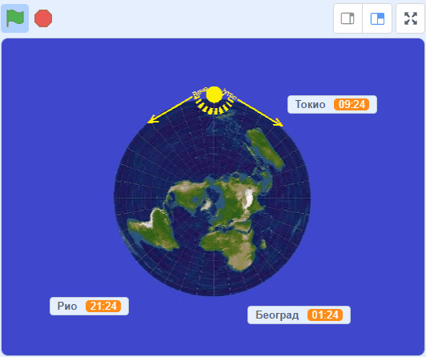
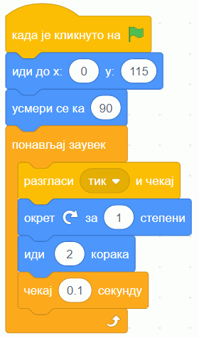

Предлог пројекта – Часовне зоне
===============================

Мотивација
----------

Као што знаш, време није исто у свим деловима света. Када је код нас подне, на истоку Азије је вече, а у Америци рано јутро. 

Можеш ли да замислиш да си високо изнад северног пола и да гледаш Земљу из васионе? Један део Земље је окренут директно ка Сунцу и на том делу је подне. Источно од тог места, Сунце је на западу и вече је, а западно од тог места је Сунце на истоку и јутро је. Када на то додамо окретање Земље око своје осе, све теже је пратити које доба дана је у ком делу света.

.. infonote::

    Циљ овог пројекта је да направиш Скреч програм, који илуструје мењање локалног времена у разним деловима света. Програм треба да помогне да се боље разумеју појмови *часовна зона*, *временска разлика* између часовних зона, веза тих појмова са географском дужином и слично.

Сценарио пројекта
-----------------

Идеја је да током рада програма Сунце кружи у смеру казаљке на сату (онако како бисмо то са Земље видели), а за то време три променљиве показују како се мења локално време у три изабрана града.

    
    Сцена током извршавања програма
    
    Слика за костим лика Земље преузета са `Wikimedia Commons <https://commons.wikimedia.org/wiki/File:Azimuthal_Equidistant_N90.jpg>`_ и дорађена
    
    Атрибуција:  RokerHRO, CC BY-SA 3.0

Анализа и планирање
-------------------

Потребно је да осмислимо које ликове ћемо имати у пројекту и када ће и какве ће скрипте да извршавају ти ликови.

Вероватно ти је из географије познат појам географске мреже, коју чине меридијани (подневци) и паралеле (упоредници). Помоћу меридијана и паралела можемо брзо (приближно) да очитамо са карте географску ширину и дужину сваког места ма Земљи.

Географска дужина је тесно повезана локалним (месним) временом. Земља је меридијанима подељена на 24 зоне, тако да се у свакој зони време рачуна по времену средњег меридијана те зоне. 

|

Део пројекта који захтева највише размишљања и нешто рачунања је усклађивање брзине окретања Сунца са брзином померања часовника, као и одређивање почетних вредности за положај Сунца и времена у појединим градовима.

Један круг Сунца око Земље (привидан круг, наравно, јер се у ствари Земља окреће око своје осе) чини :math:`360°`, а за то време протекне 24 сата. То значи да за један сат дође до окрета од :math:`{360° \over 24} = 15°`, па је за окрет од :math:`1°` потребно :math:`{60 \over 15°} = 4` минута времена. Тиме смо решили први део проблема:

.. topic:: \ 

    При сваком заокрету лика Сунца за један степен, часовнике треба померити за 4 минута.

Остаје да видимо како да изаберемо почетне вредности. Нека је Сунце на почетку у горњем положају, усмерено на десно (у том положају нацртани зраци су окренути на доле). У том тренутку је ка Сунцу окренут Земљин меридијан на 180° географске дужине (источне и западне истовремено) и тамо је подне. Истовремено, на супротној страни Земље, најдаљој од Сунца у том тренутку је поноћ (та страна је на 0° географске дужине, дакле у западној Европи). 

Како је Београд на око 20° ИГД, следи да је у описаном почетном тренутку у Београду од поноћи протекло :math:`4 \cdot 20 = 80` минута, односно сат и двадесет минута. Зато за Београд треба поставити почетно време на 01:20. Пример рачунања за Београд можемо и да уопштимо:

.. topic:: \ 

    Нека је Сунце на почетку анимације у горњем положају. Тада је почетно време на 0° поноћ. За сваки степен источно од 0° (источно од Гринича) треба померити сат за 4 минута напред, а за сваки степен западно од 0° (западно од Гринича) за 4 минута назад.
    
    На тај начин добија се природно, Сунчево време датог места. Званично локално време се за велику већину места може добити заокруживањем на најближи цео сат. 
    
У овом пројекту се нећемо бавити изузецима од горе наведеног правила, јер би то закомпликовало алгоритме, а не би допринело бољем разумевању појаве. Поменимо само да званично време зависи од државних граница, прописа у поједним државама, као и зимског и летњег рачунања времена.

Користећи правило до ког смо дошли, можемо да израчунамо почетно време било ког града, само је потребно знати географску дужину тог града. Други начин одређивања почетног времена за неки град је да се пронађу подаци о временској разлици између Београда и тог града, па се та разлика дода на време одређено за Београд  (или одузме од времена за Београд).

Ресурси
'''''''

За овај пројекат ће нам од ресурса бити потребне само слике. Слика Сунца лако може да се нацрта, а може и да се искористи и готов лик лоптице. 

За слику Земље ми смо пронашли и искористили одговарајућу слику са интернета поштујући права на употребу, као што је наведено испод анимације горе. Ти можеш да искористиш исту или неку другу слику, или да је самостално скицираш. Ако користиш готову слику, води рачуна о ауторским правима. Потребно је да то буде слика чија је употреба дозвољена, а приликом чувања пројекта на Скречовм сајту треба да се наведе извор (око ових ствари можеш да се обратиш наставнику за помоћ). 

Ликови
''''''

У нашем примеру време на сваком часовнику мења по један скривени лик. Осим ова три лика, имамо и лик Сунца, који синхронизује рад осталих ликова. Слика Земље је део позадине и није представљена посебним ликом. 

Пројекат може да се изведе и на разне друге начине. На пример, могуће је да лик Сунца буде једини у пројекту и да он директно мења времена на часовницима.

Скрипте и променљиве
''''''''''''''''''''

Ако пројекат организујеш тако да сваким сатом управља посебан лик, у том случају скрипта Сунца је једноставна и може да изгледа на пример овако. 

У зависности од величине слика Сунца и Земље, као и њиховог распореда на позорници, можда ћеш желети да задаш другачији почетни положај или број корака у петљи.

Потребне су још скрипте које управљају сатовима и оне могу да припадају било којем лику. Ако желиш и ако ти није сувише компликовано, можеш да направиш и само једну скрипту која управља свим сатовима, а у том случају листе могу да ти корисно послуже.

Друга могућност је да имаш посебну скрипту за сваки сат. Таква скрипта се активира поруком "тик" и треба да повећа време на свом сату за 4 минута. Пре него што се евентуално одлучиш за овај пројекат, размисли да ли имаш идеју како можеш да оствариш то повећање времена за 4 минута. Свакако ће ти бити једноставније да то постигнеш, ако за сваки град имаш по три променљиве: број сати, број минута и текстуално време које се види на позорници.

Самоевалуација
--------------

Када направиш програм, покушај да (пре свега себи) одговориш на ова питања:

- Да ли је, по твојој процени, пројекат успешно приведен крају? Колико си ти лично задовољан/задовољна урађеним? Зашто?
- Који део је био посебно тежак? Како си га решио/решила? Да ли је постојао неки проблем чијим решавањем се посебно поносиш?
- Да ли је било накнадних измена првобитног плана? Због чега?
- Да ли је пројекат био користан за стицање или унапређивање неких знања или вештина? Којих?

Размисли шта од овога би било интересантно другима да чују током твог представљања пројекта. 
